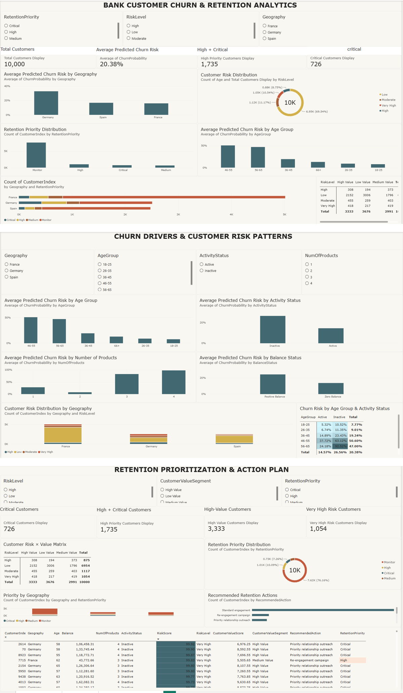

## 📊 Power BI Dashboard

An interactive Power BI dashboard was developed to translate the churn prediction and retention analysis into business-facing insights.

### Dashboard Pages

#### 1. Bank Customer Churn & Retention Analytics

Provides an overall view of:

- Total customers
- Average predicted churn risk
- High and critical priority customers
- Customer risk distribution
- Geographic churn risk
- Age-group risk patterns
- Retention priority distribution

#### 2. Churn Drivers & Customer Risk Patterns

Analyzes predicted churn risk across:

- Age groups
- Activity status
- Number of products
- Balance status
- Geography
- Risk level

#### 3. Retention Prioritization & Action Plan

Connects customer risk with the Customer Value Proxy to support:

- Critical customer identification
- High-priority customer identification
- Risk × value analysis
- Retention priority segmentation
- Recommended retention actions
- Customer-level prioritization

### Dashboard Preview

The complete interactive Power BI report is available in the repository:

[Open the Power BI report](powerbi/customer_churn_retention_dashboard.pbix)
